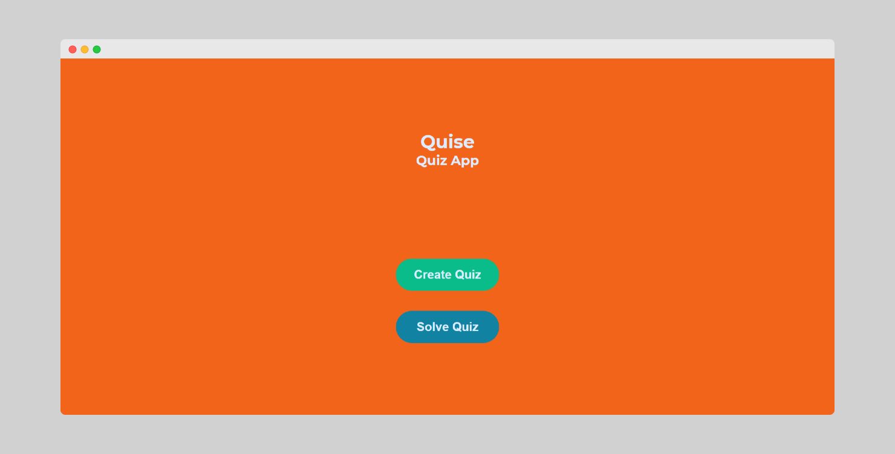

<!-- Template: https://github.com/othneildrew/Best-README-Template -->
[![MIT License][license-shield]][license-url]


<!-- PROJECT LOGO -->
<br />
<p align="center">
  <a href="https://github.com/ShatterPlayer/quise-frontend">
    
  </a>

  <h3 align="center">Quise - frontend</h3>

  <p align="center">
    Create and solve quizzes
    <br />
    <br />
    <a href="https://github.com/ShatterPlayer/quise-frontend/issues">Report Bug</a>
    ·
    <a href="https://github.com/ShatterPlayer/quise-frontend/issues">Request Feature</a>
  </p>
</p>


<!-- TABLE OF CONTENTS -->
<details open="open">
  <summary><h2 style="display: inline-block">Table of Contents</h2></summary>
  <ol>
    <li>
      <a href="#about-the-project">About The Project</a>
      <ul>
        <li><a href="#built-with">Built With</a></li>
      </ul>
    </li>
    <li>
      <a href="#getting-started">Getting Started</a>
      <ul>
        <li><a href="#prerequisites">Prerequisites</a></li>
        <li><a href="#installation">Installation</a></li>
      </ul>
    </li>
    <li><a href="#contributing">Contributing</a></li>
    <li><a href="#license">License</a></li>
  </ol>
</details>


<!-- ABOUT THE PROJECT -->
## About The Project



Quise is a simple web application intended to create and solve quizzess.


### Built With

* [React](https://reactjs.org/)
* [Redux](https://redux.js.org/)
* [Framer Motion](https://www.framer.com/motion/)
* [ReCAPTCHA](https://www.google.com/recaptcha/about/)
* [Axios](https://axios-http.com/docs/intro)


<!-- GETTING STARTED -->
## Getting Started

To get a local copy up and running follow these simple steps.

### Prerequisites

* [node version 8 or higher](https://nodejs.org/en/)
* [yarn](https://yarnpkg.com/)

### Installation

1. Clone the repo
   ```bash
   git clone https://github.com/ShatterPlayer/quise-frontend.git
   ```
   or
   ```bash
   git clone git@github.com:ShatterPlayer/quise-frontend.git
   ```
2. Install packages
   ```bash
   yarn install
   ```


<!-- CONTRIBUTING -->
## Contributing

Contributions are what make the open source community such an amazing place to be learn, inspire, and create. Any contributions you make are **greatly appreciated**.

1. Fork the Project
2. Create your Feature Branch (`git checkout -b feature/AmazingFeature`)
3. Commit your Changes (`git commit -m 'Add some AmazingFeature'`)
4. Push to the Branch (`git push origin feature/AmazingFeature`)
5. Open a Pull Request


<!-- LICENSE -->
## License

Distributed under the MIT License. See `LICENSE` for more information.


[license-shield]: https://img.shields.io/github/license/ShatterPlayer/repo.svg?style=for-the-badge
[license-url]: https://github.com/ShatterPlayer/quise-frontend/blob/first-version/LICENSE